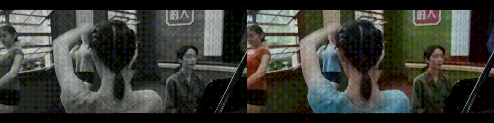

# BiSTNet: Semantic Image Prior Guided Bidirectional Temporal Feature Fusion for Deep Exemplar-based Video Colorization

### [Project Page](https://yyang181.github.io/BiSTNet/) | [Paper (ArXiv)]() | [Supplemental Material]()

**This repository is the official pytorch implementation of our paper, *BiSTNet: Semantic Image Prior Guided Bidirectional Temporal Feature Fusion for Deep Exemplar-based Video Colorization*.**

[Yixin Yang](https://imag-njust.net/)1,
[Zhongzheng Peng](https://imag-njust.net/)1,
[Xiaoyu Du](https://imag-njust.net/xiaoyu-du/)1,
[Zhulin Tao](https://ices.cuc.edu.cn/2022/1028/c5332a200498/page.htm)2,
[Jinhui Tang](https://imag-njust.net/jinhui-tang/)1,
[Jinshan Pan](https://jspan.github.io/)1  

1Nanjing University of Science and Technology, 2Communication University of China

## **🔥 NTIRE2023 Video Colorization Challenge Champion 🏆**

We are excited to announce that our method based on BiSTNet won 1st place in the [NTIRE2023 Video Colorization Challenge](https://tianchi.aliyun.com/competition/entrance/532054/rankingList/) Track 1, Fréchet Inception Distance (FID) Optimization! You can find our code and the pre-trained weights in the following links:

- [Colorization results](https://drive.google.com/drive/folders/1jwVKK2IfAp01C6KpuqB3Wcm0uT4yXZBB?usp=share_link)
- [Testing code](https://github.com/yyang181/NTIRE23-VIDEO-COLORIZATION)
- [Pre-trained models](https://github.com/yyang181/NTIRE23-VIDEO-COLORIZATION)

## Framework

## Input Videos (left column) and Colorized Videos (right column)

### To Do
- [ ] Release training code
- [x] Release testing code
- [x] Release pre-trained models

## Contact

This repo is currently maintained by Yixin Yang ([@yyang181](https://github.com/yyang181)) and is for academic research use only. 

